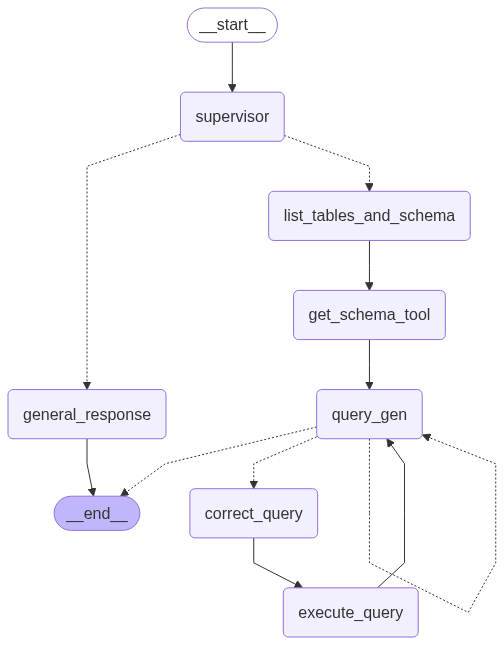
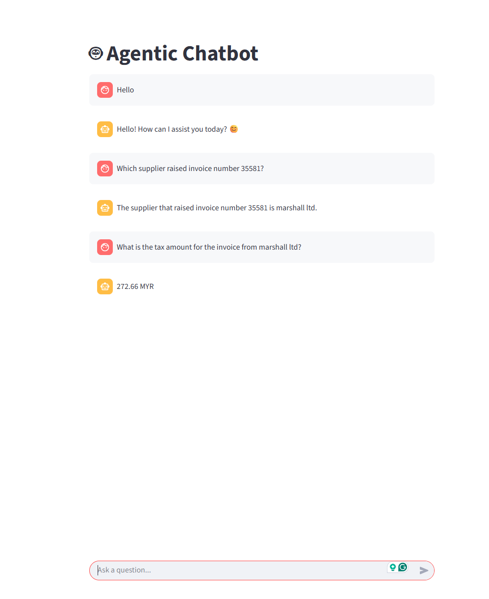

# 🤖 Agentic Chatbot

A full-stack intelligent chatbot that allows users to ask natural language questions about invoice-related data stored in a PostgreSQL database. The system uses an **agentic LangGraph workflow** to convert queries into SQL, execute them, and return human-readable answers.

## 📌 Features

- ✅ Conversational UI using **Streamlit**
- 🧠 LLM-powered natural language to SQL translation
- 🔄 Error-tolerant SQL correction and retry logic
- 🗃️ PostgreSQL database support via Docker
- 🔎 Supports complex queries: filtering, aggregation, null checks, and more
- 📊 Agent workflow built using **LangGraph**

---

## ⚙️ Architecture

<p align="center">
  
</p>

1. **User** inputs a natural language question.
2. **Supervisor node** routes based on the query type.
3. **Tools** fetch table names, schema.
4. **Query Generator** (LLM) creates SQL based on schema.
5. **Corrector** retries on SQL failures.
6. **Executor** runs the query and formats the result.

<p align="center">
  
</p>

---


## 🧱 Tech Stack

| Layer       | Tools / Libraries                        |
|-------------|-------------------------------------------|
| Frontend    | Streamlit                                 |
| Backend     | FastAPI (optional for API mode)           |
| LLM         | Groq (deepseek-r1-distill-llama-70b) or OpenAI (GPT-4o)      |
| Workflow    | LangGraph                                 |
| Database    | PostgreSQL (via Docker)                   |
| Agent Tools | LangChain tools (SQLDatabaseToolkit, etc.)|

---

## 🧪 Example Queries

### Basic Retrieval
- What is the invoice amount for invoice number 32648?
- Which supplier raised invoice number 35581?
- List all invoices with status "Extracted".

### Filtering with Conditions
- Find invoices where tax amount is greater than 100.
- Give me invoices with status "Failed" or "Partially Extracted".

### Aggregation & Summary
- What is the total invoice amount from all suppliers?
- Count the number of invoices per supplier.

### Null / Missing Checks
- Which invoices don’t have a PO number?
- Are there any suppliers with missing bill to details?

### Complex Natural Language
- Give me the details of invoices received in May 2025.
- List invoices with amount > 3000 and status != "Failed".

---

## 🐳 Running Locally

### Clone Repo
```bash
git clone https://github.com/saikumar0020/Chatbot.git
cd Chatbot
```

### Start PostgreSQL with Docker
```bash
docker run --name pg-chatbot \
  -e POSTGRES_USER=postgres \
  -e POSTGRES_PASSWORD=mysecretpassword \
  -e POSTGRES_DB=testdb \
  -p 5432:5432 \
  -d postgres
```

### Create & Activate Virtual Environment
```bash
python -m venv venv
source venv/bin/activate   # or venv\Scripts\activate on Windows
```

### Install Dependencies
```bash
pip install -r requirements.txt
```

### ▶️ Run Backend (FastAPI)

```bash
uvicorn main:app --reload --port 8000
```

### 🖥️ Run Frontend (Streamlit)

```bash
streamlit run streamlit_app.py
```
---
## 📁 Project Structure

```
📦 Chatbot/
├── main.py
├── run_service.py
├── streamlit_app.py
├── my_graph.png
├── README.md
├── requirements.txt
├── names.env
├── structure.txt
│
├── agent/
│ ├── agentic_workflow.py
│ └── init.py
│
├── config/
│ ├── config.yaml
│ └── init.py
│
├── database/
│ ├── db_connection.py
│ ├── db_connection_via_langchain.py
│ └── init.py
│
├── utils/
│ ├── config_loader.py
│ ├── db_loader.py
│ ├── model_loader.py
│ └── init.py
│
├── tools/
│ ├── get_tools.py
│ └── init.py
│
└── notebook/
├── generating_data.ipynb
├── insert_data_to_db.ipynb
├── synthetic_invoice_data.csv
├── queries.sql
└── question_to_test.txt

```

---


